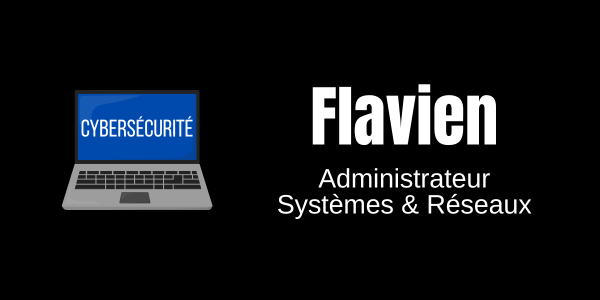

  

  <h1>Hello World, I'm Flavien ! 🇫🇷</h1>
  
  <b>🌱 *Apprenti Administrateur Systèmes & Réseaux - Passionné par la Sécurité Défensive* 🔵</b>
  
  *« Chaque faille est une porte. Certains l’ouvrent pour nuire, d’autres pour protéger. »*

---

## 📁 Gestionnaire de fichiers

### cisco-entreprise-fvrrmn
*Simulation d'une entreprise fictive avec Cisco Packet Tracer*

Concevoir un réseau d’entreprise fonctionnel, sécurisé et évolutif, capable de répondre aux besoins actuels et futurs, avec les caractéristiques suivantes :

- Architecture modulable et évolutive, facilitant l’intégration de nouvelles fonctionnalités et services.
- Segmentation du réseau via VLAN afin d’isoler les différents services pour améliorer la sécurité et la performance.
- Attribution automatique des adresses IP par DHCP pour simplifier la gestion des périphériques réseau.
- Accès sécurisé aux services internes, notamment au serveur Web, via des protocoles chiffrés et des mécanismes d’authentification appropriés.

[Cliquez ici pour voir l'infrastructure !](https://github.com/fvrrmn/cisco-entreprise-fvrrmn)
